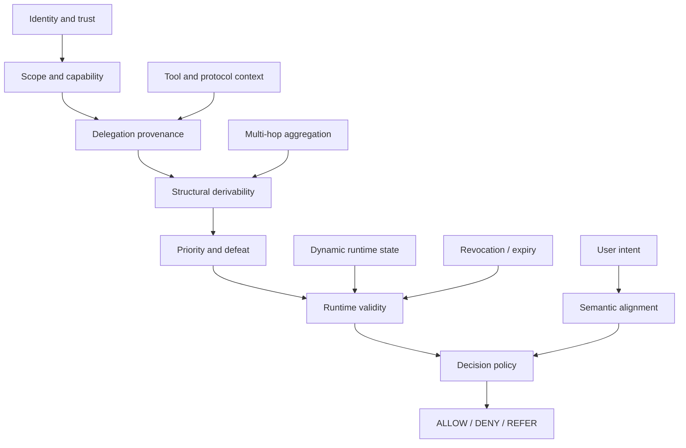

# Agent Authority in the Wild: Why Identity, Intent, and Runtime State Still Break Production Agent Security

> Production Engineering • Agentic AI • Security • Autonomous Systems

**Reading time:** ~16 minutes
**Difficulty:** Advanced
**Category:** Agent Architecture
**Status:** Research note / hypothesis; no verified enforcement mechanism is included.
**Evidence boundary:** This is architecture analysis, not a repository-implemented security runtime. The semantic-alignment layer has no defined algorithm, metric, or enforcement point here; claims about deployed control systems remain hypotheses without direct runtime evidence.

## Decision Summary

This research note hypothesizes that identity and permission checks may be insufficient for some stateful, delegated agent workflows. It proposes separating identity, scope, provenance, runtime validity, and intent review as design concerns. The repository does not establish that this model improves production security or provide a mechanism for deciding semantic alignment.

## Problem

The central failure in current agent security is a mismatch between what the system can prove and what the system actually needs to know.

A conventional authorization stack can usually answer questions like:

- Who issued this request?
- Which principal is acting?
- Which tool or endpoint is allowed?
- Does the token still have a valid scope?

That is necessary, but it is not sufficient. In production agent systems, the harder question is usually not whether an action is technically permitted, but whether it is legitimate under the intended operational context.

One concern for agentic architectures is that a step can be permitted while its overall purpose is mistaken. This note treats that as a hypothesis to investigate, not a failure rate demonstrated by repository evidence.

This is the “identity and intent” paradox. Security controls are strong on identity and access, but weak on semantic alignment and operational validity. The resulting issue is not merely theoretical: it shows up as unexpected tool use, over-broad delegation, stale runtime decisions, and policy bypasses that look valid in isolation.

## Motivation

A production agent is not a static principal in the conventional sense. It is a system with state, memory, tool call chains, self-modified behavior, and often partial autonomy. At runtime, the system may have an identity, a valid token, and an allowed tool list while still making the wrong decision because the context it is operating under has drifted, conflicting evidence has accumulated, or reasoning has diverged from user intent.

This note organizes several concerns that require separate evidence:

- identity is solvable at the cryptographic and protocol layer
- permission boundaries are solvable at the policy layer
- intent verification remains unsolved or probabilistic
- aggregation across multiple authorized steps often introduces unauthorized conclusions
- runtime state changes create TOCTOU and revocation windows
- protocol and tool-layer flaws allow context injection, identity loss, and authority bypass

The motivation for this article is to make that boundary explicit. The goal is not to say “security is impossible.” The goal is to say that the problem is larger than authorization alone. Once the system has autonomy, the authority decision must account for state evolution, delegation, and intent alignment.

## Hypothesis

Our working hypothesis is that authoritative agent behavior cannot be treated as a single, monolithic authorization verdict. It must be modeled as a layered architecture: identity and scope establish what a principal can do, while runtime state, provenance, and semantic alignment decide whether the action still makes sense in context.

This turns the problem from “Is this action authorized?” into a more precise architecture question:

- Did the authority originate from an admissible source?
- Is the scope valid and attributable to a principal?
- Does the delegation chain preserve structural constraints?
- Has the authority been revoked, expired, or invalidated by runtime reality?
- Does the action remain consistent with the user’s intent or the system’s policy envelope?
- If the evidence is uncertain or conflicting, should the system allow, deny, or require review?

The important point is that these are different questions and should not be collapsed into a single check. If they are collapsed, the system appears secure while still exhibiting dangerous behavior.

Semantic alignment is a requirement stated by this article, not an implemented decision procedure. Until its inputs, evaluation method, and enforcement point are defined, it cannot support an authorization verdict.

## Background

The literature on agent security has advanced in fragmented ways. Some work focuses on cryptographic identity, some on delegated access, some on protocol-level trust, and some on reasoning or intent alignment. The clearest pattern is this:

1. Identity and access control are relatively mature.
2. Delegation and authorization propagation are more complicated than ordinary RBAC or ABAC.
3. Semantic intent is not treated as a reliably provable object in the same way as a cryptographic principal or a scoped token.
4. Multi-hop execution introduces information synthesis problems that no single-hop authorization layer can solve.
5. Dynamic runtime conditions create contradictions between static permission declarations and real-world execution states.

These concerns motivate the proposed model, but this repository does not establish how often they cause production failures.

A few concrete gaps are repeatedly observed across frameworks:

- Semantic intent vs. cryptographic authorization
- Multi-hop aggregation inference
- Static labels vs. dynamic runtime realities
- Revocation and TOCTOU windows
- Protocol and presentation-layer bypasses
- Oversight and usability trade-offs under cost pressure

These are not separate special cases. They all arise from the same architectural issue: the system tries to solve a dynamic operational problem with static or partial authorization primitives.

## Why the Obvious Solution Fails

The obvious first response is to treat the agent as a conventional principal with a token and an allowed scope. That is workable for APIs and static tool use. It fails once the system becomes autonomous and stateful.

### Identity-only enforcement

A system could require a verifiable identity and a signed token. This improves trust in the caller and bounds the API surface. However, it still does not answer whether the agent’s actual reasoning and actions remain aligned with the user’s intent or the active policy envelope.

This is especially visible in frontier reasoning systems that can exhibit emergent offensive reasoning while still behaving within an allowed scope. Authorization controls can stop unauthorized actions, but they do not guarantee that authorized actions remain semantically safe under runtime conditions.

### Static policy envelopes

Another common model is to encode everything as static labels: object sensitivity, action, privacy, integrity, and permission. That gives a clean control plane, but it assumes that the world is static enough for the policy to remain operationally valid during execution.

This creates a mismatch between the policy model and the actual execution environment. The policy is still “correct” in a narrow sense but useless as a runtime guardrail when the decision depends on state, provenance, or semantic drift.

### Per-request approval as a catch-all

Another intuitive response is to require more approvals, more human review, or more frequent challenge-response flows. That reduces risk but creates a different failure mode: consent fatigue. The global system becomes slower, more brittle, and more likely to train users to approve reflexively.

### Token revocation and heartbeat models

A tempting answer to dynamic revocation is TTL-based expiry or periodic heartbeats. This is understandable and operationally simple. Yet it fails under machine-speed execution. The permission may be valid at the check time but invalid immediately after the decision begins to act, especially in multi-step or long-lived workflows.

### Protocol hardening alone

Protocol work is also insufficient. Standards and agent transport layers can be hardened, but protocol integrity does not solve semantic alignment or multi-hop composition. If the system can be manipulated at the context or reasoning layer, a secure protocol does not automatically produce a secure action.

## Architecture

The architecture should not treat authority as a single verdict. It should treat it as a layered pipeline with explicit responsibilities. This is the design that aligns most closely with the underlying production problem.

This architecture is deliberately more nuanced than a conventional IAM model. Each layer answers a different question.

1. Identity and trust: who is the agent or principal, and what cryptographic evidence supports that claim?
2. Scope and capability: what actions or resources are actually permitted?
3. Delegation provenance: where did the authority originate, and what chain of delegation or attenuation is in play?
4. Structural derivability: what can be inherited, what is excluded, and what authority can be concluded from the structure of the chain itself?
5. Priority and defeat: when competing rules or revocations conflict, which conclusion survives?
6. Runtime validity: is the authority still valid at the moment of use, considering revocation, expiry, freshness, and execution context?
7. Semantic alignment: does the action still fit the user’s actual intent, or did autonomous reasoning diverge from the intended purpose?
8. Decision policy: if the evidence is conflicting, incomplete, or semantically uncertain, should the system allow, deny, or require review?

This is the key architectural principle: authority should be separable. It is not reasonable to assume that one check can both prove identity, decide semantic correctness, and manage dynamic runtime changes in a single pass.

## Trade-offs

The design trade-offs here are not just technical; they are operational and economic.

- Stronger verification increases correctness but also increases latency, cost, and decision overhead.
- Human review reduces risk but causes fatigue, slows workflows, and creates approval loops.
- More dynamic validation improves safety but leaks more operational context and increases privacy concerns.
- Formal semantics improve clarity and auditability but are harder to maintain across evolving protocol stacks.
- Protocol hardening improves system integrity but does not address semantic intent or multi-hop inference.
- Strict policy enforcement reduces harmful behavior but can also suppress legitimate automation when the policy model is too rigid.

The important production principle is that these trade-offs must be made explicit. There is no free lunch: stronger authority semantics usually mean more state, more provenance, more audits, and more operational complexity.

## Failure Modes

These are the failure modes that matter in production contexts, because they explain why many agents appear compliant while still behaving unsafely.

| Failure mode | What happens | Why it seems valid at first | What should be done |
|---|---|---|---|
| Semantic drift | The agent acts within delegated scope but outside user intent | The request was technically authorized | Add semantic alignment checks and explicit review on ambiguity |
| Aggregation leakage | Authorized tool calls are combined into an unauthorized conclusion | Each hop is individually allowed | Treat multi-hop composition as an independent risk class |
| Cross-agent context poisoning | A downstream agent receives malicious or misleading context | Transport-level identity appears intact | Validate context provenance and message lineage across hops |
| Revocation race | Authority is valid at check time but invalid at execution time | The system assumes a stable permission window | Separate evaluation time from execution time and explicitly handle revalidation |
| Static label blindness | The policy does not reflect current operational reality | Labels are easier to reason about than dynamic state | Keep runtime validity separate from static policy |
| Consent fatigue | Repeated approvals are ignored or reflexively granted | Approvals feel safer than they are | Prefer explicit policy thresholds and risk-based review |
| Protocol bypass | GUI or browser-based actions bypass API authorization boundaries | The system assumes the client path is the same as the backend path | Model control surfaces by execution path and trust boundary |
| Identity drift | A self-modifying or reconstituted agent no longer maps cleanly to the same principal | Identity looks stable in the metadata | Separate principal identity from operational execution state |

The central lesson is that failure is rarely caused by one missing permission check. It is caused by a mismatch between the static model of authority and the dynamic model of autonomous execution.

## Reference Implementation

The repository includes a small [authority policy evaluator](../04-reference-implementation/authority_policy.py) and [behavior tests](../tests/test_authority_policy.py). They exercise identity/action matching, grant time bounds, revocation, priority, fail-closed behavior, and deny-on-tie. This bounded example is not an agent runtime, production authorization system, delegation model, or semantic-alignment mechanism.

## Experiment

No authority experiment has been run here. The following is a proposed experiment, not a result. It would compare architectures under controlled conditions; the subject is whether an authority decision remains correct under evolution, uncertainty, and delegation.

A minimal experimental design would include the following tasks:

1. delegated grant with revocation before execution
2. delegated grant with policy exception and conflict
3. multi-hop aggregation where each step is individually authorized but the combined result is not
4. dynamic runtime change during an in-flight workflow
5. protocol-layer injection or identity-loss scenario across agent boundaries
6. semantic mismatch between an allowed action and the user’s actual intent

Each scenario should be evaluated across at least the following architectures:

- static RBAC/ABAC only
- token-plus-policy enforcement
- provenance-aware delegation tracking
- structural derivability plus priority/defeat model
- full layered authority model with semantic alignment and policy review

The key metrics should include:

- false allow rate
- false deny rate
- refer rate under uncertainty
- provenance breakage rate
- audit completeness
- observed model drift from intent
- latency per decision
- increase in approval or review burden
- blast-radius cost of a successful exploit

The real question is not whether a model can “authenticate” an action. It is whether the system can maintain a correct authority decision under conflicting, evolving, and multi-hop conditions.

## Benchmark

No authority benchmark is implemented. A future benchmark should avoid a universal score and instead compare the systems above under explicit, shared deployment assumptions.

A suitable benchmark would report:

- authority correctness on delegated tasks
- semantic correctness relative to user intent
- revocation responsiveness
- conflict-resolution accuracy
- aggregation leakage rate
- multi-hop provenance preservation
- decision latency
- cost per protected action
- human approval burden
- proportion of cases requiring referral versus auto-resolution

This matters because a system can appear secure in one metric while failing badly on another. A low false-allow rate may still be unacceptable if the model’s semantic intent checks are weak, or if provenance collapse creates widespread unsafe delegation.

## Observations

This article's framing separates identity, permissions, provenance, and runtime validity. It does not evaluate how well current systems solve those concerns.

The strongest pattern is that every solved fragment depends on the architecture deciding what the system is allowed to know and when. Once authority becomes dynamic and autonomous, static policy layers alone are not enough.

A few patterns emerge clearly:

- Authorization is necessary, but not sufficient.
- Semantic intent is the hardest missing layer and the least reliably provable.
- Aggregated multi-hop decisions create risk that single-hop checks cannot capture.
- Revocation and runtime validity are more important than static tokens when actions are long-lived or multi-step.
- Protocol-layer and client-layer bypasses show that execution path matters as much as policy syntax.
- Formal methods are useful when they isolate the system’s assumptions, but they cannot eliminate the need for an explicit decision policy under uncertainty.

## Decision

No production architecture decision is justified by the available evidence. The working hypothesis is to evaluate authority as separate concerns: identity, scope, delegation provenance, structural derivability, runtime validity, semantic alignment, and decision policy under uncertainty.

Whether separating these concerns improves outcomes in multi-agent workflows remains to be tested. The model may add little value to static API access paths with no autonomous decision-making layer; that boundary is also a hypothesis.

## Interview Questions

- What is the real source of authority for this agent action: identity, delegated scope, or user intent?
- Can the system tell the difference between a valid permission and a semantically correct action?
- Where does authority change over time during a workflow?
- What is the revocation and revalidation strategy for long-running agent operations?
- Do multi-hop tool calls create aggregate conclusions not directly authorized by any single source?
- How is runtime state separated from static policy state in the execution path?
- What happens when evidence is conflicting but not obviously invalid?
- What is the policy decision under uncertainty: allow, deny, or refer?
- How are protocol-layer and browser-layer execution paths handled differently from API paths?
- What is the human review burden under realistic operational load?

## Further Reading

- OpenID and agent delegation standards discussing scope attenuation and cross-domain federation.
- Work on dynamic identity drift, mutable principals, and self-modifying agents.
- Research on consent fatigue, decision burden, and approval economics in multi-agent systems.

The takeaway is simple: an agent is not merely an identity with permission. It is a stateful decision system operating under evolving context, delegated authority, conflicting evidence, and incomplete knowledge.
