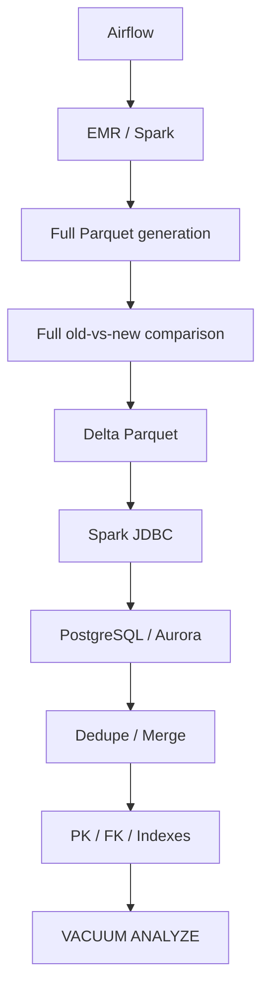
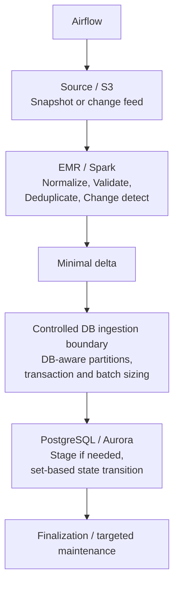
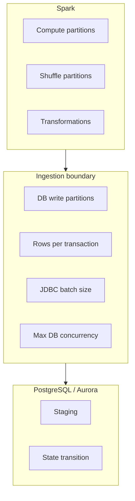
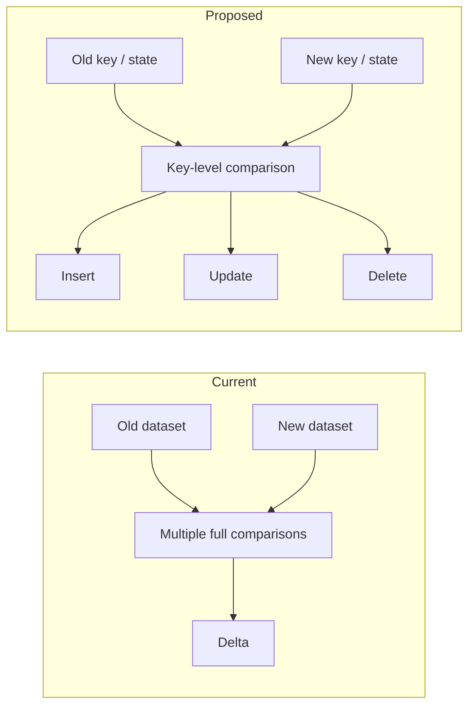
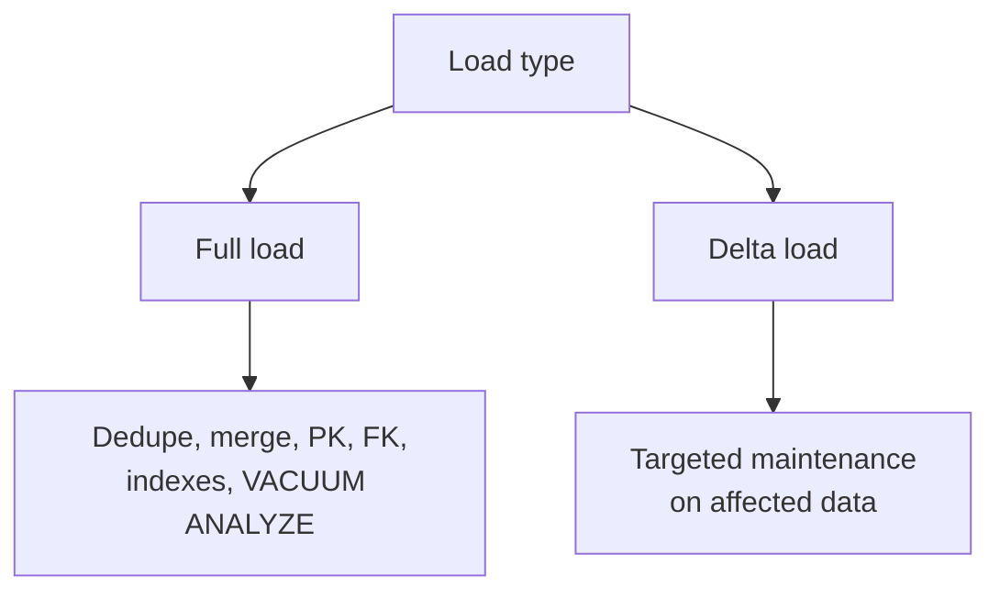

# Architecture: EMR → Spark → PostgreSQL/Aurora Ingestion

**Status:** Conceptual architecture analysis. Not implemented in this repository.
**Evidence boundary:** The Airflow, EMR, Spark, and PostgreSQL/Aurora pipeline described here is a supplied design under review. This repository contains no pipeline code, datasets, logs, topology, or benchmarks for it. Every proposed change is a design hypothesis until matched by code, telemetry, or deployment evidence.

---

## 1. Purpose and Scope

This document describes the current ingestion architecture and a proposed evolution that lowers end-to-end latency from EMR to PostgreSQL/Aurora while preserving correctness.

**In scope:** data flow, component responsibilities, the ingestion boundary, database state transitions, and the finalization lifecycle.
**Out of scope:** parameter tuning, instance sizing, and new infrastructure.

## 2. Architectural Drivers

| Driver | Statement |
|---|---|
| Latency | Minimize total path time, not any single stage in isolation. |
| Correctness | Entity identity, insert/update/delete semantics, transaction guarantees, referential integrity, and idempotency must be preserved. |
| Simplicity | Prefer simplifying the existing design over adding components. |
| Evidence | No improvement is claimed until measured. |

```
T_total = T_EMR_startup + T_Spark_compute + T_Spark_shuffle + T_S3
        + T_JDBC + T_DB_commit + T_DB_merge + T_finalization
```

## 3. Current-State Architecture



### Component responsibilities (current)

| Component | Responsibility |
|---|---|
| Airflow | Orchestration and scheduling of pipeline stages |
| EMR / Spark | Snapshot processing, full comparison, delta generation |
| S3 | Storage for full snapshots and delta Parquet |
| JDBC layer | Transfer of delta rows from Spark to PostgreSQL |
| PostgreSQL / Aurora | Staging, dedupe, delete, merge, constraint and index creation |
| Finalization | PK, FK, indexes, VACUUM, ANALYZE |

## 4. Architectural Pressure Points

These are design hypotheses derived from the structure above, not measured bottlenecks.

1. **Full-frame comparison.** Large datasets are compared in full to discover a comparatively small set of changes.
2. **Coupled partitioning.** Spark compute partitioning, JDBC write partitioning, transaction size, and database concurrency appear to be driven by the same controls.
3. **Data volume across the boundary.** More data than the minimal delta may cross EMR → network → RDS.
4. **Database-side reduction.** PostgreSQL performs dedupe, delete, and merge work that may be reducible upstream.
5. **Uniform finalization.** The same full maintenance cycle may run for both full and incremental loads.

## 5. Target-State Architecture



The target is shaped by repository evidence. If the evidence contradicts a step, the step is dropped.

## 6. Key Design Decisions

| # | Area | Current | Proposed | Rationale | Risk |
|---|---|---|---|---|---|
| D1 | Delta generation | Full old-vs-new comparison | Key/change-based comparison | Avoid repeated full scans and shuffles | Requires stable entity keys and a clear definition of "update" |
| D2 | Partitioning | One set of controls for compute and DB writes | Separate compute, write, and transaction controls | Each concern has a different optimum | More configuration surface |
| D3 | EMR → RDS volume | Large dataset, DB reduces it | Minimal delta crosses the boundary | Less transfer and less DB work | Moving logic upstream must not weaken correctness |
| D4 | Delta staging | Stage → delete → upsert | Stage → set-based merge, if staging is still required | Fewer statements and less transaction work | Staging may be required for type compatibility, enums, or recovery |
| D5 | Finalization | Same cycle for every load | Full finalization for full loads; targeted maintenance for deltas | Avoid unnecessary post-load work | Maintenance semantics must be validated |
| D6 | Change source | Full snapshot | Change feed, if upstream supports it | Potentially the largest reduction | Not assumed to exist; requires upstream investigation |

## 7. Ingestion Boundary

The boundary separates four concerns that are currently coupled.



| Concern | Governs |
|---|---|
| Spark compute partitioning | Parallelism of transformation work |
| JDBC write partitioning | Number of concurrent writers |
| Transaction size | Lock duration, WAL volume, failure blast radius |
| Database concurrency | Contention and connection use |

The boundary should be a module-level abstraction in the existing code base, not a new service.

## 8. Delta Generation Flow



A change signature such as `entity_id + content_hash` is only introduced if it reduces full-row comparison and the existing semantics allow it. The following must be settled first:

- What is the current entity identity?
- What constitutes an update?
- Does ordering matter, and are duplicates meaningful?
- Can existing deduplication and set-difference steps be narrowed safely?

## 9. PostgreSQL Responsibilities

Principle: Spark performs distributed computation; the database remains the authoritative state store.

| Operation | Disposition |
|---|---|
| Bulk insert | Keep in RDS |
| Staging | Keep in RDS, reduce scope if possible |
| Delete / merge | Reduce to a single set-based transition |
| Deduplication | Move upstream only if semantics are preserved |
| PK / FK / constraints | Keep in RDS |
| Index creation | Defer to finalization; do not move earlier without evidence |
| VACUUM / ANALYZE | Keep; evaluate targeted scope for delta loads |

Database constraints and correctness-critical state transitions are never moved to Spark for speed alone.

## 10. Finalization Lifecycle



Whether delta loads can use targeted maintenance depends on repository semantics and measured behavior. VACUUM ANALYZE is not removed without evidence.

## 11. Architectural Principles

1. Eliminate unnecessary work before tuning parameters.
2. Reduce data volume before it crosses the EMR → RDS boundary.
3. Keep Spark compute, write concurrency, and transaction size independently controllable.
4. Keep correctness-critical state transitions in the database.
5. Add infrastructure only with a repository-backed reason. Kafka, Flink, Debezium, Redis, new services, and new databases are not introduced by default.
6. Do not recommend RDS sizing, IOPS, connection, memory, or autovacuum changes without production metrics.

## 12. Evolution Path

The change is incremental, not a rewrite.

| Phase | Focus |
|---|---|
| 1 | Observability: stage-level timing and row counts |
| 2 | Remove confirmed redundant work |
| 3 | Decouple compute, write, and transaction controls |
| 4 | Key/change-based delta generation, if semantics allow |
| 5 | Set-based merge in place of delete + upsert, if staging allows |
| 6 | Targeted maintenance for delta loads |
| 7 | Change-feed investigation, only with upstream evidence |

## 13. Open Questions

| Question | Needed to resolve |
|---|---|
| Stable entity keys and update semantics | Pipeline code and data model |
| Presence of CDC, version, or `updated_at` upstream | Upstream source investigation |
| Where time is actually spent | Stage-level timings |
| Database contention and write pressure | CPU, IOPS, latency, connections, WAL volume, lock waits |
| Safe scope of targeted maintenance | Validation against real delta loads |

## 14. Conclusion

The architecture can likely be improved without a complete rewrite. The smallest evolution with the most leverage is to reduce what crosses the EMR → RDS boundary (D1, D3) and to decouple compute partitioning from database write behavior (D2). Both are hypotheses until measured.