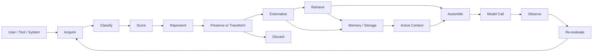
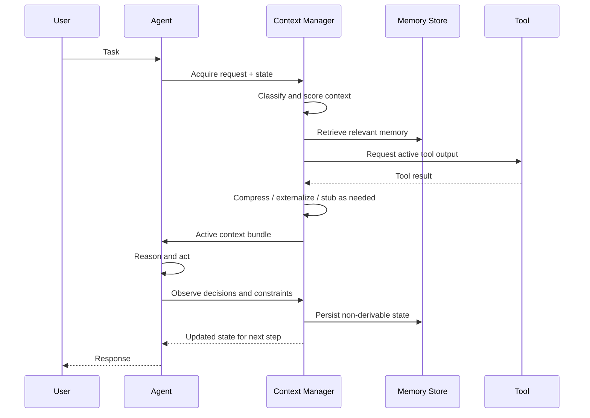

# Beyond Token Windows: Engineering the Context Lifecycle of Production Agents

> Production Engineering • Agentic AI • Context Engineering • Reliability

**Reading time:** ~15 minutes
**Difficulty:** Advanced
**Category:** Context Engineering
**Status:** Research Article

## Decision Summary

The real production problem is not that an agent has too many tokens in a single prompt; it is that context has no lifecycle and therefore accumulates without explicit rules for preservation, transformation, retrieval, or discard. We recommend treating context as a managed resource: classify information by importance, recoverability, and derivability, then assemble only the minimal active bundle required for the next task. The business impact is that systems become more reliable, cheaper, and easier to reason about because they stop depending on brittle historical leakage and expensive full-context rebuilds. The cost of getting this wrong is recurring failures such as hallucinated decisions, repeated rejected plans, stale memory overriding the present task, and prompt-cache churn that makes a model feel unstable under load.

## Problem

Production agents are often evaluated by the size of their context window, yet the actual failure mode is usually not the maximum token count. It is the absence of a disciplined context lifecycle. Information enters the system from the user, tools, retrieved documents, earlier turn history, memory stores, and intermediate reasoning, but there is rarely a clear policy for what should survive the current task, what should be compressed, what should be externalized, and what should be forgotten.

This creates several recurring problems. First, a system may keep too much information in the active prompt and degrade reasoning quality with token noise. Second, it may keep too little, losing causal constraints that were critical to earlier decisions. Third, it may preserve information that is recoverable from an authoritative source while wasting precious prompt budget on a low-value duplicate. Fourth, it may preserve testimonial information — preferences, trade-offs, and assumptions expressed during a task — without recognizing that this is exactly the kind of state that can be lost in naive compression and then reintroduced later as a repeated failure mode.

The result is a production condition that feels almost always the same: the agent appears capable in short interactions, but across longer sessions it becomes inconsistent, stale, repetitive, or expensive to run.

## Motivation

In demos, context is often simplified into a single conversation transcript. In production, the system is better described as a set of overlapping context streams:

- system instructions and policy
- user state and preferences
- current task state
- tool results and retrieved evidence
- historical dialogue
- persistent memory
- intermediate execution artifacts
- externalized summaries and structured state

Each stream has a different lifetime, mutability, and cost of loss. A single-window abstraction ignores these differences and treats all context as if it were one long, homogeneous message. That is convenient for prompting but wrong for engineering.

The motivation for this article comes from a common production pattern: improvements in model quality, retrieval quality, or tool use do not help if the agent repeatedly reintroduces stale assumptions, loses important constraints, or rebuilds context expensively at every step. The system then becomes a prompt assembly problem masquerading as an intelligence problem.

## Hypothesis

Our working hypothesis is that production agents should manage context as an explicit lifecycle problem rather than as a token-budget problem. The right design is not “more memory” or “less memory”; it is “the cheapest representation that preserves the information necessary for future decisions.”

This changes the engineering question from “How many tokens fit in the window?” to “What information should an agent carry forward, retrieve, compress, externalize, discard, or reconstruct—and in what representation, for how long, and at what cost?”

## Background

The early literature on LLM systems focused heavily on the context window and prompt length. That framing is useful for understanding model limits, but it is incomplete for production systems. In a real agent, context is not just a single static prompt; it is a moving state, and state has lifecycle properties: acquisition, classification, selection, transformation, persistence, retrieval, and disposal.

A practical production context model separates the information into several classes:

1. System or policy context: stable instructions that define the agent's operating constraints.
2. Request-level context: the task, user intent, and current tool call context.
3. Conversation context: the recent turn history that explains the current interaction.
4. Historical context: prior tasks, decisions, and constraints that may matter later.
5. User-level context: the user's preferences or recurring constraints.
6. Task state: state that is actively being built and mutated during a workflow.
7. Tool context: inputs, outputs, and side effects from external systems.
8. Retrieved context: documents or knowledge fetched in response to a query.
9. Persistent memory: information retained beyond the current session.
10. Externalized artifacts: structured decisions, summaries, or state stored outside the prompt.
11. Operational state: agent execution metadata, tool invocation status, intermediate checkpoints, and retry state.
12. Derived evidence: facts reconstructed from authoritative sources rather than preserved as a transcript of a prior interaction.

These categories are not interchangeable. A stable instruction should not be treated like a volatile tool result. A user preference may deserve a long retention policy, while a temporary retrieval result may be safely discarded once it has been used to form a decision.

It is important to distinguish what in this article is a well-established design observation and what is still a hypothesis. The established point is that context should be classified by function, lifetime, recoverability, and mutability rather than by a single prompt window. The more speculative part is the specific retention-policy model proposed here: that context should be moved between representations and locations based on a score over recoverability, derivability, information-loss cost, and current-task relevance. That model is useful as a design framework, but it should be treated as an engineering proposal rather than as a universal law.

The most important distinction is between derivable and testimonial information. Derivable information can usually be recovered from a trusted source such as a tool result, a document, a database, or an artifact store. Testimonial information exists primarily in the interaction history itself: a preference expressed by a user, a decision rationale, a rejected alternative, a constraint negotiated in an earlier turn, or an assumption that was established during execution. The same fact may be derivable in one system and testimonial in another. The right question is not simply whether the information is still in the conversation, but whether it is recoverable outside the conversation and whether losing it would create a recurring failure mode.

## Why the Obvious Solution Fails

Several solutions appear reasonable when a team first encounters this problem, and each of them fails in a different way.

### Full conversation history

The simplest design is to append the entire conversation and keep the user-facing transcript in the active prompt. This preserves richness, but it creates a scale problem. Every new turn adds more tokens, more duplicated facts, and more opportunities for stale assumptions to re-enter the reasoning path. Long histories also degrade the signal-to-noise ratio: a relevant fact may be buried under repeated restatements, tool chatter, and harmless but low-value conversational filler.

### Sliding-window context

A sliding window is often the first operational improvement. It keeps the most recent turns and drops older ones. This helps with latency and token consumption, but it fails when the critical information is not the most recent. A user preference, a rejected alternative, or a constraint discovered in an earlier phase may not be visible in the most recent window even though it determines the right next action. Recency is a poor proxy for causal relevance.

### Summarization

Summarization appears to solve the problem by compressing old turns into a shorter memory. The problem is that compression is lossy and silent. It can remove a rejected alternative that should remain visible as a warning, a constraint that was later overridden, or a rationale that the agent would need to avoid repeating a bad decision. In short, “summary” is often a location where important anti-patterns get erased.

### Persistent memory + retrieval

This is usually more robust than raw history, but it introduces a different class of failures. Retrieval can be stale, incomplete, or semantically off-target. The wrong memory may override the current task state, or a low-quality retrieval may cause the agent to reason with a mis-specified object. This is especially dangerous when the system cannot distinguish deriveable facts from testimonial state that exists only in the interaction history.

### Cache-aware compaction without lifecycle rules

Many teams optimize for prompt-cache stability and run compaction on a timer. This can reduce active tokens but increase cache invalidation churn. If compaction is done too often, the system pays the cost of rebuilding prefixes repeatedly. If it is done too rarely, the prompt grows and user-visible latency grows with it. In both cases, no clear decision framework explains why the selected state is the one worth preserving.

## Architecture

The architecture should treat context management as a lifecycle pipeline rather than a single prompt string. The core sequence is:

That lifecycle is intentionally different from “just keep the last N turns.” It creates several required engineering decisions.

- Acquisition: what information enters the system and from what source?
- Classification: is this a policy object, retrieved fact, tool result, task state, or user preference?
- Scoring: what is the value of preserving this information for the current task and later ones?
- Representation: should this live as raw text, structured state, a summary, or a pointer to external storage?
- Preservation or transformation: should it remain losslessly in the active context or be compressed, summarized, or externalized?
- Externalization: should the system store this in an artifact store, a retrieval index, or a memory record?
- Retrieval: when is it worth fetching this back into active context?
- Assembly: what minimal bundle is necessary before the next model call?
- Observation: what happened in the model call and what did it actually need?
- Re-evaluation: what should be reclassified, discarded, or retained after the task is complete?

The important architectural idea is that context is not “stored.” It is moved between representations and places according to a retention policy. This is more than a slogan. It means that information must be scored on multiple properties before it is kept, summarized, externalized, or discarded. In a production system, a useful rule is not just “keep the most recent” or “keep what is still in the window.” The rule is closer to: keep the minimal representation that preserves the information that is still relevant, still costly to reconstruct, or still necessary to prevent repeated failure. In practice, that means weighting at least five dimensions: relevance to the current task, recoverability from trusted sources, derivability, information-loss cost if it is discarded, and cache or assembly cost if it is retained. Recency matters, but it is only one signal among several.

This is also where prompt caching becomes part of the design rather than an afterthought. A stable system prompt or structured task state can be a good cache prefix; a volatile, frequently changing state cannot. If the system repeatedly compacts or rewrites the same prefix, the cost of invalidation may exceed the savings from shorter prompts. The right question is not “how many tokens are in the context?” but “what representation has the lowest total cost to retain, reassemble, and revalidate across the next task cycle?”

## Trade-offs

The natural trade-off is not simply “shorter prompt” versus “longer prompt.” It is among correctness, cost, latency, recoverability, and operational stability.

- Full-history context maximizes recall but increases latency, noise, and cache churn.
- Sliding-window context reduces token use but loses causal continuity.
- Summaries lower costs but may remove critical constraints or rejected alternatives.
- Retrieval improves precision but adds retrieval latency and requires a robust memory schema.
- Externalization reduces prompt size but creates a new failure mode: the system may lose state if the artifact is stale or malformed.
- Deterministic stubs for tool outputs improve cache stability but can hide useful detail if the stub is too coarse.
- Compaction policies that ignore cache invalidation can look efficient while creating a higher system-level cost than they save.

A good production system therefore needs a composite policy. It should preserve critical constraints losslessly, externalize large or recoverable tool results, retrieve only when needed, summarize user-visible context selectively, and leave the system with simple rules for what is safe to discard. The important engineering question is not whether a fact is recent, but whether it is necessary, recoverable, and worth preserving at the current cost of attention and latency.

## Failure Modes

These are the failure modes that matter in production systems, because they are exactly the kinds of issues that show up after the model is “working” in demos.

| Failure mode | What happens | Why it feels correct at first | What should be done |
|---|---|---|---|
| Critical constraint dropped in summary | The agent forgets a prior limitation or user rule | Summary looked smaller and cleaner | Preserve safety- and task-critical constraints losslessly |
| Rejected alternative reappears | The agent repeats a solution that was already rejected | The short memory forgot the rationale | Treat decision traces as testimonial state and retain them selectively |
| Stale memory overrides task state | Old facts win over current task information | Memory retrieval is treated as a general signal | Separate active state from historical memory and resolve conflicts explicitly |
| Retrieval noise overwhelms signal | The system is overloaded with irrelevant memory | Retrieval feels “helpful” but is semantically broad | Score retrieval and distinguish evidence from background context |
| Cache invalidation costs more than compaction saved | Frequent compaction breaks stable prefixes | Prefix stability was assumed to be free | Measure cache rebuild cost and compaction cadence explicitly |
| Tool result ballooning | Large tool outputs crowd the active context | Tool outputs look authoritative and easy to retain | Externalize large results and replace them with deterministic stubs |
| Unrecoverable lossy transformation | A summarizer removes information that could have been reconstructed | The summary seemed compact and sufficient | Only compress when information-loss cost is low |

The key insight is that most of these failures do not look like model failures. They look like context governance failures.

## Reference Implementation

This repository does not yet include a full production-ready context lifecycle implementation; that is a separate engineering artifact from the article itself. The closest concrete examples in this repo are the response-delivery and filtering patterns in [04-reference-implementation/](../04-reference-implementation/), especially the adaptive response filter, which shows the same underlying principle: preserve the important state, externalize large artifacts, and optimize the boundary between the system and the next consumer.

The reference pattern for this article is therefore architectural rather than a single class: keep explicit state, separate stable and dynamic context, and make retention policy visible instead of implicit.

## Experiment

A credible experiment should isolate context strategies under controlled workloads rather than rely on anecdotal interaction quality. The goal is not to prove that one policy is universally dominant. It is to compare how strategies behave under long-running tasks with changing state and retrieval pressure.

A minimal experiment would use a fixed set of tasks that require:

1. state retention across several turns
2. retrieval of prior facts
3. a rejected-alternative path that must not be repeated
4. large tool outputs that could be externalized
5. tasks with both stable and volatile constraints

Each task is run under at least four strategies:

- full history
- sliding-window context
- summary-based memory
- hybrid lifecycle management with retrieval and externalization

For each run, we measure:

- end-to-end task success
- number of repeated decisions
- number of constraints lost
- prompt token count
- cache invalidation frequency
- retrieval latency
- model-call count
- wall-clock latency
- user-observed task consistency

The experimental point is not whether a strategy reduces tokens; it is whether it preserves the right information without introducing system instability.

## Benchmark

The benchmark should not pretend to produce a single universal number. It should instead produce a defensible comparison under controlled conditions. A useful benchmark design would report:

- total active context tokens
- retrieved context tokens
- retained memory size
- inference cost per task
- compaction frequency
- cache rebuild rate
- repeated-decision rate
- end-to-end latency P50/P95
- task success rate

This is especially important for prompt caching. A strategy that appears cost-efficient in raw token count can still be worse if it destroys cache stability and forces large prefix rebuilds. Context management cannot be evaluated on prompt length alone.

## Observations

The main observation is that context quality is not a simple function of recency or token count. The best production systems treat context as a constrained resource with a retention policy, not a bag of everything that happened over time.

A few patterns emerge from the production reasoning behind this article:

- Stable policy and system instructions should be separate from volatile task state.
- Recoverable facts should often live outside the active prompt and be retrieved only when needed.
- Testimonial information — decisions, constraints, and rejected alternatives — often matters more than it appears at the moment it is created.
- Compaction is a system design problem, not just a summarization problem.
- Prompt-cache behavior changes the economics of context management in ways that raw token numbers do not capture.
- The output side of the system matters too: response delivery can become slower when the system optimizes only input-side token reduction while ignoring stream assembly, serialization, and user-visible latency.

This does not prove a universal algorithm. It does suggest that the production design must make context lifecycle an explicit part of the architecture and must clearly separate what is known, what is observed, and what remains a hypothesis to be measured.

## Decision

The architecture decision is to treat context as a managed lifecycle with explicit retention and retrieval policies rather than as an unbounded transcript or a single fixed-size window. This means keeping the active context small, preserving critical constraints losslessly, externalizing large or recoverable artifacts, and retrieving only when a future task genuinely needs them.

This decision is most valuable in long-running, multi-step, tool-using agents where the context is not merely conversational but operational. It is less valuable in a short, stateless prompt-response flow where history is cheap and task state is minimal.

## Interview Questions

- What information is stable, what is transient, and what is recoverable?
- Which constraints are critical to preserve losslessly and which can be re-derived?
- Where do you currently lose causal continuity in long-running tasks?
- How do you detect that a memory record is stale or incorrectly overriding a current task?
- What is the cost of prompt-cache invalidation during compaction?
- How do you distinguish testimonial context from derived context?
- What is the highest-cost failure mode if the agent forgets a previous constraint?
- Where are tool outputs being kept as raw text when they should be externalized or stubbed?
- What is the smallest active context bundle that still preserves required task reasoning?
- What metrics prove the system is improving context quality rather than merely reducing prompt size?

## Further Reading

- Ellis, D. and others. Practical work on memory and retrieval systems for long-lived agents.
- OpenAI and Anthropic documentation on tool-use, memory, and state management patterns in production agents.
- Research on long-context evaluation, summarization failure modes, and retrieval quality.
- Work on prompt caching and prefix stability in large language model serving systems.
- Production engineering literature on observability, incident analysis, and state management under partial failure.

The main takeaway is simple: context engineering is not a matter of squeezing more tokens into a model. It is the discipline of deciding what information survives, how it survives, and whether it can be recovered when the task changes.

---

## Additional Diagram

