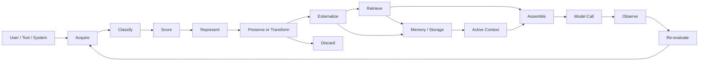
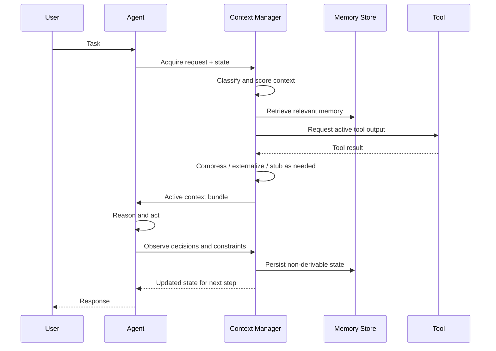

# Beyond Token Windows: Engineering the Context Lifecycle of Production Agents

> Production Engineering • Agentic AI • Context Engineering • Reliability

**Reading time:** ~15 minutes
**Difficulty:** Advanced
**Category:** Context Engineering
**Status:** Research Article

> Status: Research article.
> Evidence boundary: This article documents a design and lifecycle model; the repository does not include a production context manager, and measured latency or cost claims remain illustrative unless backed by a concrete implementation and benchmark.

## Decision Summary

The real production problem is not that an agent has too many tokens in a single prompt; it is that context has no lifecycle and therefore accumulates without explicit rules for preservation, transformation, retrieval, or discard.

## Problem

Production agents are often evaluated by the size of their context window, yet the actual failure mode is usually not the maximum token count. It is the absence of a disciplined context lifecycle.

This creates several recurring problems. First, a system may keep too much information in the active prompt and degrade reasoning quality with token noise. Second, it may keep too little, losing critical constraints or historical decisions. Third, a system may preserve the wrong information too long, causing stale memory to override fresh task state.

The result is a production condition that feels almost always the same: the agent appears capable in short interactions, but across longer sessions it becomes inconsistent, stale, repetitive, or overconfident in its memory.

## Motivation

In demos, context is often simplified into a single conversation transcript. In production, the system is better described as a set of overlapping context streams:

- system instructions and policy
- user state and preferences
- current task state
- tool results and retrieved evidence
- historical dialogue
- persistent memory
- intermediate execution artifacts
- externalized summaries and structured state

Each stream has a different lifetime, mutability, and cost of loss. A single-window abstraction ignores these differences and treats all context as if it were one long, homogeneous message. That is not how production agents behave.

The motivation for this article comes from a common production pattern: improvements in model quality, retrieval quality, or tool use do not help if the agent repeatedly reintroduces stale assumptions or loses important constraints after a few turns.

## Hypothesis

Our working hypothesis is that production agents should manage context as an explicit lifecycle problem rather than as a token-budget problem. The right design is not “more memory” or “less memory.” The right design is a retention and retrieval policy that matches the type and value of the information.

This changes the engineering question from “How many tokens fit in the window?” to “What information should an agent carry forward, retrieve, compress, externalize, discard, or reconstruct?”

## Background

The early literature on LLM systems focused heavily on the context window and prompt length. That framing is useful for understanding model limits, but it is incomplete for production systems. In practice, the agent's working memory is a mixture of stable policy, volatile task state, tool outputs, external evidence, and decisions that may need to be retained or discarded differently.

A practical production context model separates the information into several classes:

1. System or policy context: stable instructions that define the agent's operating constraints.
2. Request-level context: the task, user intent, and current tool call context.
3. Conversation context: the recent turn history that explains the current interaction.
4. Historical context: prior tasks, decisions, and constraints that may matter later.
5. User-level context: the user's preferences or recurring constraints.
6. Task state: state that is actively being built and mutated during a workflow.
7. Tool context: inputs, outputs, and side effects from external systems.
8. Retrieved context: documents or knowledge fetched in response to a query.
9. Persistent memory: information retained beyond the current session.
10. Externalized artifacts: structured decisions, summaries, or state stored outside the prompt.
11. Operational state: agent execution metadata, tool invocation status, intermediate checkpoints, and retry state.
12. Derived evidence: facts reconstructed from authoritative sources rather than preserved as a transcript of a prior interaction.

These categories are not interchangeable. A stable instruction should not be treated like a volatile tool result. A user preference may deserve a long retention policy, while a temporary retrieval result may be discarded after the tool call finishes.

It is important to distinguish what in this article is a well-established design observation and what is still a hypothesis. The established point is that context should be classified by function and retention policy, not by a single token count.

The most important distinction is between derivable and testimonial information. Derivable information can usually be recovered from a trusted source such as a tool result, a document, a database, or a fresh retrieval. Testimonial information captures decisions, trade-offs, rejections, constraints, and rationale; it often matters even when a simpler summary would be cheaper.

## Why the Obvious Solution Fails

Several solutions appear reasonable when a team first encounters this problem, and each of them fails in a different way.

### Full conversation history

The simplest design is to append the entire conversation and keep the user-facing transcript in the active prompt. This preserves richness, but it creates a scale problem. Every new turn adds more tokens, more noise, and more stale assumptions into the current reasoning state.

### Sliding-window context

A sliding window is often the first operational improvement. It keeps the most recent turns and drops older ones. This helps with latency and token consumption, but it fails when the critical information is not the most recent. Long-running tasks often need earlier constraints, prior decisions, or rejected alternatives preserved even when they are no longer near the end of the transcript.

### Summarization

Summarization appears to solve the problem by compressing old turns into a shorter memory. The problem is that compression is lossy and silent. It can remove a rejected alternative that should remain accessible, or a critical constraint that later becomes relevant again.

### Persistent memory + retrieval

This is usually more robust than raw history, but it introduces a different class of failures. Retrieval can be stale, incomplete, or semantically off-target. The wrong memory may override the current task state and lead to a confident but incorrect answer.

### Cache-aware compaction without lifecycle rules

Many teams optimize for prompt-cache stability and run compaction on a timer. This can reduce active tokens but increase cache invalidation churn. If compaction is done too often, the system pays a large cost in rebuilds and unstable prefixes.

## Architecture

The architecture should treat context management as a lifecycle pipeline rather than a single prompt string. The core sequence is:

That lifecycle is intentionally different from “just keep the last N turns.” It creates several required engineering decisions.

- Acquisition: what information enters the system and from what source?
- Classification: is this a policy object, retrieved fact, tool result, task state, or user preference?
- Scoring: what is the value of preserving this information for the current task and later ones?
- Representation: should this live as raw text, structured state, a summary, or a pointer to external storage?
- Preservation or transformation: should it remain losslessly in the active context or be compressed, summarized, or externalized?
- Externalization: should the system store this in an artifact store, a retrieval index, or a memory record?
- Retrieval: when is it worth fetching this back into active context?
- Assembly: what minimal bundle is necessary before the next model call?
- Observation: what happened in the model call and what did it actually need?
- Re-evaluation: what should be reclassified, discarded, or retained after the task is complete?

The important architectural idea is that context is not “stored.” It is moved between representations and places according to a retention policy. This is more than a slogan. It means that information can be lost deliberately, externalized, compressed, retrieved, or reconstructed according to a system-specific lifecycle.

This is also where prompt caching becomes part of the design rather than an afterthought. A stable system prompt or structured task state can be a good cache prefix; a volatile, frequently changing tool result should not be treated as if it were stable prompt infrastructure.

## Trade-offs

The natural trade-off is not simply “shorter prompt” versus “longer prompt.” It is among correctness, cost, latency, recoverability, and operational stability.

- Full-history context maximizes recall but increases latency, noise, and cache churn.
- Sliding-window context reduces token use but loses causal continuity.
- Summaries lower costs but may remove critical constraints or rejected alternatives.
- Retrieval improves precision but adds retrieval latency and requires a robust memory schema.
- Externalization reduces prompt size but creates a new failure mode: the system may lose state if the artifact is stale or malformed.
- Deterministic stubs for tool outputs improve cache stability but can hide useful detail if the stub is too coarse.
- Compaction policies that ignore cache invalidation can look efficient while creating a higher system-level cost than they save.

A good production system therefore needs a composite policy. It should preserve critical constraints losslessly, externalize large or recoverable tool results, retrieve only when needed, summarize carefully, and explicitly track which information is still trustworthy.

## Failure Modes

These are the failure modes that matter in production systems, because they are exactly the kinds of issues that show up after the model is “working” in demos.

| Failure mode | What happens | Why it feels correct at first | What should be done |
|---|---|---|---|
| Critical constraint dropped in summary | The agent forgets a prior limitation or user rule | Summary looked smaller and cleaner | Preserve safety- and task-critical constraints losslessly |
| Rejected alternative reappears | The agent repeats a solution that was already rejected | The short memory forgot the rationale | Treat decision traces as testimonial state and retain them selectively |
| Stale memory overrides task state | Old facts win over current task information | Memory retrieval is treated as a general signal | Separate active state from historical memory and resolve conflicts explicitly |
| Retrieval noise overwhelms signal | The system is overloaded with irrelevant memory | Retrieval feels “helpful” but is semantically broad | Score retrieval and distinguish evidence from background context |
| Cache invalidation costs more than compaction saved | Frequent compaction breaks stable prefixes | Prefix stability was assumed to be free | Measure cache rebuild cost and compaction cadence explicitly |
| Tool result ballooning | Large tool outputs crowd the active context | Tool outputs look authoritative and easy to retain | Externalize large results and replace them with deterministic stubs |
| Unrecoverable lossy transformation | A summarizer removes information that could have been reconstructed | The summary seemed compact and sufficient | Only compress when information-loss cost is understood and accepted |

The key insight is that most of these failures do not look like model failures. They look like context governance failures.

## Reference Implementation

This repository does not yet include a full production-ready context lifecycle implementation; that is a separate engineering artifact from the article itself. The closest concrete examples in this repo are the architectural patterns and local implementation boundaries, not a full context manager.

The reference pattern for this article is therefore architectural rather than a single class: keep explicit state, separate stable and dynamic context, and make retention policy visible instead of implicit.

## Experiment

A credible experiment should isolate context strategies under controlled workloads rather than rely on anecdotal interaction quality. The goal is not to prove that one policy is universally dominant; it is to compare retention policies under workload conditions that stress context drift and stale memory.

A minimal experiment would use a fixed set of tasks that require:

1. state retention across several turns
2. retrieval of prior facts
3. a rejected-alternative path that must not be repeated
4. large tool outputs that could be externalized
5. tasks with both stable and volatile constraints

Each task is run under at least four strategies:

- full history
- sliding-window context
- summary-based memory
- hybrid lifecycle management with retrieval and externalization

For each run, we measure:

- end-to-end task success
- number of repeated decisions
- number of constraints lost
- prompt token count
- cache invalidation frequency
- retrieval latency
- model-call count
- wall-clock latency
- user-observed task consistency

The experimental point is not whether a strategy reduces tokens; it is whether it preserves the right information without introducing system instability.

## Benchmark

The benchmark should not pretend to produce a single universal number. It should instead produce a defensible comparison under controlled conditions. A useful benchmark design would report:

- total active context tokens
- retrieved context tokens
- retained memory size
- inference cost per task
- compaction frequency
- cache rebuild rate
- repeated-decision rate
- end-to-end latency P50/P95
- task success rate

This is especially important for prompt caching. A strategy that appears cost-efficient in raw token count can still be worse if it destroys cache stability and forces large prefix rebuilds. Context quality is not just a prompt-size problem.

## Observations

The main observation is that context quality is not a simple function of recency or token count. The best production systems treat context as a constrained resource with a retention policy, not as an unbounded transcript.

A few patterns emerge from the production reasoning behind this article:

- Stable policy and system instructions should be separate from volatile task state.
- Recoverable facts should often live outside the active prompt and be retrieved only when needed.
- Testimonial information — decisions, constraints, and rejected alternatives — often matters more than it appears at the moment it is created.
- Compaction is a system design problem, not just a summarization problem.
- Prompt-cache behavior changes the economics of context management in ways that raw token numbers do not capture.
- The output side of the system matters too: response delivery can become slower when the system optimizes only input-side token reduction while ignoring stream assembly, serialization, and user-perceived latency.

This does not prove a universal algorithm. It does suggest that the production design must make context lifecycle an explicit part of the architecture and must clearly separate what is known, what is derived, and what is merely remembered.

## Decision

The architecture decision is to treat context as a managed lifecycle with explicit retention and retrieval policies rather than as an unbounded transcript or a single fixed-size window. This means classifying information by role, storing it where it belongs, and retrieving only what is necessary for the current task.

This decision is most valuable in long-running, multi-step, tool-using agents where the context is not merely conversational but operational. It is less valuable in a short, stateless prompt-response system.

## Interview Questions

- What information is stable, what is transient, and what is recoverable?
- Which constraints are critical to preserve losslessly and which can be re-derived?
- Where do you currently lose causal continuity in long-running tasks?
- How do you detect that a memory record is stale or incorrectly overriding a current task?
- What is the cost of prompt-cache invalidation during compaction?
- How do you distinguish testimonial context from derived context?
- What is the highest-cost failure mode if the agent forgets a previous constraint?
- Where are tool outputs being kept as raw text when they should be externalized or stubbed?
- What is the smallest active context bundle that still preserves required task reasoning?
- What metrics prove the system is improving context quality rather than merely reducing prompt size?

## Related Topics

- Ellis, D. and others. Practical work on memory and retrieval systems for long-lived agents. <!-- TODO: verify source exists -->
- OpenAI and Anthropic documentation on tool-use, memory, and state management patterns in production agents.
- Research on long-context evaluation, summarization failure modes, and retrieval quality.
- Work on prompt caching and prefix stability in large language model serving systems.
- Production engineering literature on observability, incident analysis, and state management under partial failure.

The main takeaway is simple: context engineering is not a matter of squeezing more tokens into a model. It is the discipline of deciding what information survives, how it survives, and whether the system can recover it when the next decision depends on it.

---

## Additional Diagram

