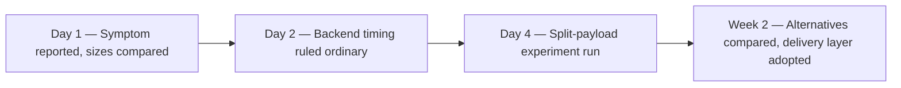
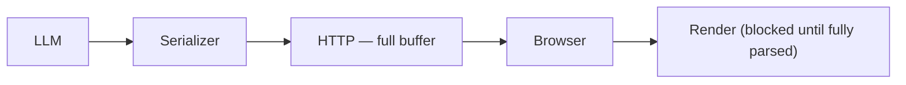
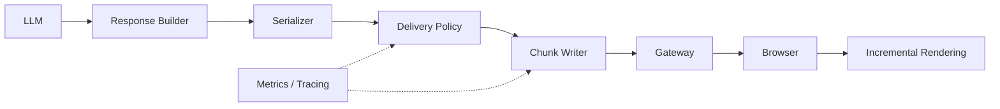
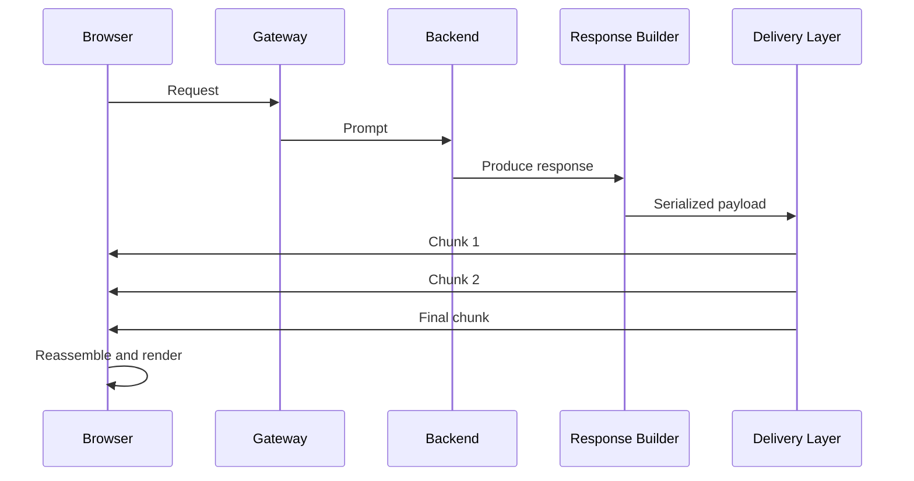
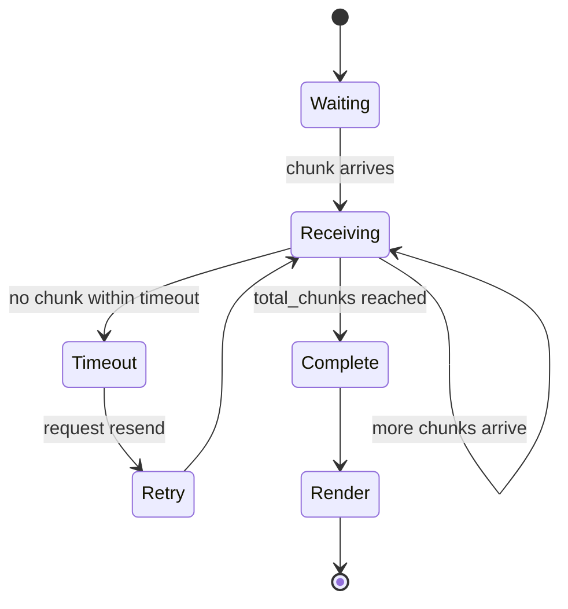

# The Last Mile of LLM Serving: When Response Delivery Becomes the Bottleneck in Agentic AI

> Production Engineering • Agentic AI • System Design • LLM Serving

**Reading time:** ~14 minutes
**Difficulty:** Advanced
**Category:** Production Engineering
**Status:** Generalized production investigation; local measurements are illustrative and not reproducible from this repository

> **Note:** This article abstracts an engineering investigation performed while building a production AI application. Architecture, benchmarks, payload shapes, and implementation details have been generalized to keep the story useful without exposing the original system.

> > Status: Research / generalized production investigation.
> Evidence boundary: The timings in this article are illustrative and environment-specific; the repository does not contain the original production stack, so these results are not treated as production SLA or deployment evidence.

**Implementation boundary:** The production investigation described here is broader than the executable code in this repository. The Python reference is a pedagogical slice for policy, chunk splitting, and reconstructed delivery semantics.

## Executive Summary

Most work on LLM serving optimizes inference: GPU scheduling, KV-cache management, batching, speculative decoding, attention kernels. But production systems do not end when the model finishes generating tokens; they end when the user can actually see useful output.

This article investigates a bottleneck that appeared *after* inference had already completed: response delivery. In this system, large structured responses delayed the moment users saw any progress, even when the backend had already produced the content.

**Key takeaways**

- In this system, the observed latency appeared primarily in response delivery, not model inference.
- Splitting large payloads improved time-to-first-visible-content without touching inference time.
- The delivery layer preserved the existing HTTP contract instead of requiring a transport migration.
- The team favored incremental rollout over a full redesign, given the constraints described below.

**What this is not:** a new transport protocol, a replacement for SSE/WebSockets, a universal optimization, or a formal experimental study — no statistical significance testing is implied by the examples here.

**The evidence, illustrative:** the stage breakdown below is representative of the kind of split observed in this system's proxy benchmark, not a captured production trace.

| Stage | Time |
|---|---|
| Model generation | 780 ms |
| Serialization | 35 ms |
| Network | 120 ms |
| Browser parse/render | 1.7 s |

In the representative case shown, generation finished quickly, but the user-visible delay spanned the full delivery and rendering pipeline. This example illustrates the kind of split observed, not a formal production benchmark.

## Where This Fits in the LLM Serving Stack

| Layer | Concern | Example |
|---|---|---|
| GPU scheduling | Batching and request scheduling on the GPU | Sarathi-Serve |
| KV cache management | Memory-efficient attention state | vLLM |
| Attention computation | IO-aware attention kernels | FlashAttention |
| Token-level serving | Structured generation execution | SGLang |
| **Response delivery** | **Getting a finished (or partially finished) response to the user quickly** | **This work** |

Prior systems in the rows above optimize inference throughput, GPU utilization, and memory efficiency. This work starts *after* generation completes — none of those optimizations help if a fully formed payload is still held in a buffer before the browser can render anything.

## The Production Problem

Requests with large responses felt slower and less reliable than smaller ones, even when the backend had already produced most of the useful content. Two requests sharing the same model, backend path, and dataset could differ primarily in how the response was serialized and delivered.

The same response was generated two ways: once as a single large payload, once as two smaller parts delivered sequentially. The second form reduced time-to-first-visible-content with zero change to model inference time.


**Why browser rendering can become the bottleneck:** browser work does not scale linearly with payload size like network transfer does. After bytes arrive, the browser must parse JSON, allocate objects, mutate the DOM, and paint before the user sees the response.

### Root cause chain

```text
Generation completes
        │
        ▼
Response serialized as one object
        │
        ▼
Entire payload buffered before sending
        │
        ▼
Browser receives one large payload
        │
        ▼
JSON parsing blocks the main thread
        │
        ▼
DOM update delayed until parsing finishes
        │
        ▼
User perceives latency, even though generation finished earlier
```

The fix targets the third step — “entire payload buffered before sending” — not generation, not the network, and not the browser's parser itself.

## Latency Decomposition

Total latency can be decomposed as:

```
L = Tg + Ts + Tn + Tp + Tr
```

`Tg` generation, `Ts` serialization, `Tn` network transfer, `Tp` browser parse, `Tr` render/paint. But what a user actually perceives is not `L`; it is closer to:

```
Perceived latency = TTFB + time until first renderable chunk + browser render
```

The instinct is to optimize `Tg`. The metric that governs perceived responsiveness is *time to first visible content*. The delivery layer's job is to shrink that term without necessarily shrinking total payload size or inference cost.

> **Engineering principle:** Before redesigning a production system, decompose end-to-end latency into measurable stages, then optimize the dominant term — not the most visible subsystem.

## Investigation

| Observation | Hypothesis | Result |
|---|---|---|
| Backend timing looked ordinary even on the worst-perceived requests | Generation (LLM) is the bottleneck | ❌ Rejected |
| No meaningful correlation between data-access latency and the symptom | Database is the bottleneck | ❌ Rejected |
| Explained some cases but not the consistent effect tied to payload shape | Network is the bottleneck | ⚠️ Partial |
| Splitting a response with no change to total work still improved perceived latency | Delivery semantics are the bottleneck | ✅ Accepted |



More server capacity, compression, or waiting for network improvements target the wrong term in the equation above — they shrink `Tn` or reduce tail variance, but they do not necessarily improve when the user first sees content.

## Controlled Experiments

**Experiment A — controlled split test.** The same response was generated once as a single payload and once as two sequential parts, holding backend, infrastructure, model, and browser constant.

*Illustrative example:* In local testing, a single large payload (250 KB) showed visible content significantly later than the same content split into two smaller parts. This pattern held across multiple iterations.

**Experiment B — payload scaling.**

*Illustrative representative values (local proxy benchmark, not production measurements):*

| Response size | TTFB | TTLB | Browser parse | Render | Total UX delay |
|---|---|---|---|---|---|
| 10 KB | 120 ms | 140 ms | 20 ms | 25 ms | 145 ms |
| 40 KB | 128 ms | 155 ms | 24 ms | 40 ms | 195 ms |
| 100 KB | 135 ms | 170 ms | 60 ms | 180 ms | 350 ms |
| 250 KB | 142 ms | 190 ms | 90 ms | 1.1 s | 1.3 s |
| *Std deviation (σ), illustrative* | *±8 ms* | *±12 ms* | *±5 ms* | *±15 ms* | *±45 ms* |

**Experiment C — network degradation.** The same response shapes were replayed over a degraded connection, since the production symptom appeared worse under jitter.

**Experiment D — architecture comparison.** Full-buffer baseline vs. compression, pagination, structured streaming, and the eventual delivery layer.

**Benchmark setup (illustrative, not production):** 20 warmup requests (discarded), 50 measured requests per scenario, median and P95 reported, Chrome 138, HTTP/1.1, local proxy host, 250 KB structured JSON payload.

> Important boundary note: the numerical values in Experiment A, Experiment B, and Appendix E are illustrative operating examples, not a formal production benchmark. This repository does not include the original production measurements or reproducible benchmarking harness.

## Production Constraints

Browser-based client on existing HTTP request-response semantics, no assumed migration to WebSockets, backward-compatible API contract, incremental low-risk rollout, full observability. These constraints matter because they push the design toward a boundary change rather than a transport change.

## Alternatives Considered

| Approach | Complexity | UX | Compatibility | Latency improvement | Operational risk |
|---|---|---|---|---|---|
| Full response buffering | Low | Low | High | Low | Low |
| Compression | Low | Medium | High | Medium | Low |
| Pagination | Medium | Medium | High | Medium | Medium |
| HTTP streaming | Medium | Medium | Medium | High | Medium |
| SSE / WebSockets | High | High | Low | High | High |
| Adaptive response delivery | Medium | High | High | High | Medium |

**Why not streaming?** The existing product shared a request-response contract across multiple clients. Full streaming support would have meant protocol changes across frontend, gateway, and API layers, which was a larger operational change than the bottleneck justified.

**Why not token streaming?** Token streaming exposes model output as tokens are generated, which helps conversational UX but does not address reconstruction of a large, nested, non-text payload. The delivery problem here was boundary latency, not streaming a text generation stream.

## Architecture Decision Record

```text
Decision:
  Introduce a response delivery layer between the response builder
  and the HTTP response writer.

Status:
  Accepted

Context:
  Large structured payloads delayed first visible content, independent
  of model inference time.

Alternatives considered:
  Compression, Pagination, HTTP streaming, SSE, WebSockets

Rejected because:
  Each either failed to move first-visible-content earlier (compression,
  more server capacity) or required more transport/protocol change than
  the bottleneck justified (streaming, SSE, WebSockets).

Accepted because:
  Preserves the existing HTTP contract, deploys at a single boundary,
  and measurably improves perceived latency with a bounded rollout risk.

Consequences:
  + Faster time to first visible content
  + Small, boundary-scoped deployment
  - Client-side reconstruction logic required
  - Additional delivery-layer failure modes to manage
```

## Delivery Layer Design

```
if payload is small:      return it normally
if payload is large:      split into structured chunks
if response is UI/tool-heavy: expose partial content earlier
if payload has nested objects or long text: favor chunk boundaries that preserve semantic coherence
if the client can't safely reassemble state: fall back to the full-buffer path
```

**Threshold justification:** the initial threshold was chosen empirically by plotting payload size against browser render time in local testing. Render cost stayed relatively flat below ~100–120 KB, then rose sharply as the payload grew beyond that range.

## Chunk Boundary Algorithm

Boundary strategies are tried in priority order, falling through to the next only when the current strategy cannot produce chunks under the size limit:

```text
for strategy in [json_boundary, tool_boundary, heading, paragraph, sentence]:
    chunks = strategy(payload)
    if chunks satisfy threshold:
        return chunks
return fixed_size(payload)
```

The reference implementation (`chunker.py`) demonstrates the JSON-boundary and fixed-size-fallback strategies. The middle strategies (`tool_boundary`, `heading`, `paragraph`, `sentence`) follow the same general pattern but are not fully implemented in this local slice.

| Component | Complexity |
|---|---|
| Splitting | O(n) |
| Reassembly | O(n) |
| Ordering (buffer + sort) | O(k log k) |
| Memory | O(payload size) |

(`n` = payload size in bytes, `k` = chunk count.)

## Architecture

The following architecture and sequence diagrams describe the production design discussed by the article. The repository's smaller, actual Python sequence is shown in `diagrams/adaptive-response-delivery/`.

**Before:**



**After:**



The backend logic that produces the response is unchanged in both diagrams — only the boundary between the response builder and the browser changed.



Additional diagrams (client state machine, trace timeline, rollout stages) are in the appendices to keep the main article to one architecture diagram and one sequence diagram.

### Reference implementation

The checked-in implementation lives in `04-reference-implementation/adaptive-response-filter/`. `policy.py` applies byte thresholds, `chunker.py` splits top-level JSON object members or valid UTF-8 boundaries, and `reassembler.py` validates and reconstructs fragments.

The local sequence serializes the whole response before it yields envelopes. The reassembler buffers until all chunks arrive, then returns reconstructed bytes or merged JSON-object bytes; it does not emulate a full browser or network stack.

The contract is intentionally educational. CRC32 detects accidental corruption but is not authentication. Retries, timeouts, partial UI state, transport framing, and multi-message multiplexing belong to a larger production system, not this local reference slice.

### Design principles

- Don't change the transport.
- Don't require client changes beyond opting into the chunked contract.
- Preserve the existing API contract.
- Keep the rollout reversible at every stage.
- Measure before optimizing, and keep measuring after.

## Observability

```text
payload_size, chunk_count, avg_chunk_size, serialization_ms
TTFB, TTLB, p50_first_visible, p95_first_visible, reassembly_ms
json_parse_ms, render_block_ms, main_thread_block_ms, paint_ms
chunk_retries, reassembly_failures, duplicate_chunks, out_of_order_chunks, fallback_rate
```

The frontend-side metrics (`json_parse_ms`, `render_block_ms`, `main_thread_block_ms`, `paint_ms`) matter as much as the backend ones — they're what actually confirmed the browser-rendering bottleneck.

## Representative Impact

*The following values are from local proxy benchmarks to illustrate the kind of improvement observed. They are not production measurements and should not be reproduced without similar controlled benchmarking.*

| Approach | First visible (P50) | First visible (P95) | TTLB | Browser render |
|---|---|---|---|---|
| Full buffering | ~2.4 s | ~3.1 s | ~2.8 s | ~1.1 s |
| Adaptive response delivery | ~480 ms | ~720 ms | ~2.9 s | ~320 ms |

The key observation is that chunking moves time-to-first-visible-content much earlier without increasing total transfer time. Recovery metrics (chunk retransmission, fallback rates) are tracked in the same telemetry stream.

## Trade-offs and Limitations

Faster first visible content, but more delivery-layer complexity and a partial-completion contract the client must honor. Limited value when responses are already small, generation dominates late-stage latency, or the client cannot reassemble partial state safely.

**Threats to validity:** single production architecture, one browser, one transport version. Results may differ under HTTP/2 or HTTP/3, other browsers or mobile clients, high packet loss, or GPU scheduling differences.

**When not to use this:**

- Responses are already small — the threshold logic just adds overhead for no benefit.
- SSE or WebSockets are already available and the client already handles them.
- Payloads are mostly binary rather than structured JSON/text.
- Inference genuinely dominates end-to-end latency, so delivery isn't the bottleneck to begin with.
- Clients can't safely buffer and reassemble partial state.

## Rollout Strategy


At each stage: P50/P95 first-visible-content, client error rate, fallback rate, and duplicate/out-of-order chunk rate were checked before expanding further.

## Related Work

vLLM, Sarathi-Serve, Orca, and FlashAttention optimize inference throughput, GPU utilization, and memory efficiency — the layers above the response-delivery row in the stack table earlier. This repository is concerned with the boundary immediately after generation finishes.

| Work | Optimizes | Layer |
|---|---|---|
| FlashAttention | Attention kernels | GPU |
| vLLM | KV cache | Serving |
| Orca | Request scheduling | Serving |
| Sarathi-Serve | Batching | Serving |
| **This work** | Response delivery | Client / HTTP |

## Future Work

- Adaptive chunk sizing based on payload shape
- Incremental JSON parsing on the client
- HTTP/3 evaluation

## Engineering Lessons

- Production bottlenecks are often outside the component initially blamed.
- Perceived latency often matters more than total latency.
- Delivery contracts deserve the same design attention as generation algorithms.

Modern LLM serving research has dramatically improved how quickly models generate tokens. Production systems, however, are judged by something different: how quickly users perceive progress. Between generation completion and visible output sits a delivery layer that can dominate the user experience.

## Appendix A — Example Payload

```json
{
  "plan": { "steps": ["retrieve", "summarize", "cite"] },
  "tool_output": { "result": "..." },
  "citations": [{ "source": "doc-1", "span": [0, 120] }],
  "metadata": { "model": "example", "latency_ms": 812 }
}
```

## Appendix B — Chunk Metadata

```json
{
  "sequence": 0,
  "total_chunks": 3,
  "checksum": "9a3f1c02",
  "is_final": false,
  "merge_mode": "concat",
  "payload": "..."
}
```

The checksum value is an illustrative CRC32-shaped example. The repository's `WireEnvelope` computes the actual CRC32 over each UTF-8 payload fragment; CRC32 does not establish who sent the frame or whether the sender is authorized.

## Appendix C — Reassembly Algorithm

1. Create one `Reassembler` per message. It is not a multi-message session manager.
2. Validate envelope types, positive `total_chunks`, the sequence range, `is_final`, merge mode, checksum format, and configured chunk/payload bounds.
3. Fix the expected `total_chunks` and merge mode from the first accepted frame; reject later frames that change either value.
4. Verify CRC32 before storing payload. An identical duplicate is ignored while the message is incomplete; a duplicate sequence with different content is rejected.
5. Wait until all sequence indexes are present, then either concatenate `concat` fragments as bytes or parse and merge `json-object` fragments by top-level key.
6. The method returns bytes only when complete. It does not request a resend or expose partial data to a UI; transport retry, timeout, and rendering policy are not implemented.

See `04-reference-implementation/adaptive-response-filter/reassembler.py` for the runnable receiver.

## Appendix D — Conceptual Client State Machine and Failure Modes

The following state machine describes a possible production client integration. It is not implemented by the Python reference code; in particular, no timeout, retry, or fallback-to-partial-state logic is included in the local slice.



| Failure | Symptom | Handling |
|---|---|---|
| Missing chunk | Reassembly never completes | Timeout → request resend |
| Duplicate chunk | Reassembly could double-apply | Idempotent merge keyed by sequence |
| Late chunk | UI appears to "jump" | Buffer until in-order, don't render out of sequence |
| Interrupted stream | Client stuck in partial state | Fallback to full-buffer re-request after timeout |

## Appendix E — Benchmark Detail and Trace

```text
Warmup requests:     20 (discarded)
Measured requests:   50
Reported statistics: median (P50), P95
Machine:              local proxy host, no external network hop
Browser:              Chrome 138
Transport:            HTTP/1.1
Payload:              250 KB structured JSON
```

Representative first-visible-content distribution, full buffering vs. adaptive delivery (from local benchmark):

```text
Full buffering        (median ~2.4s)   ■■■■■■■■■■■■
Adaptive delivery      (median ~480ms) ■■■
```

Representative trace shape for a chunked response (illustrative, not a production trace):

```text
span: request                         [0ms -------------------- 2900ms]
  span: serialization                 [0ms -- 40ms]
  span: delivery.chunk[0]             [40ms - 480ms]   <- first visible content
  span: delivery.chunk[1]             [480ms - 1600ms]
  span: delivery.chunk[2]             [1600ms - 2900ms]
  span: browser.render (per chunk)    [overlaps each chunk span]
```

## References

**Academic**

- Dean, J., and Barroso, L. A. "The Tail at Scale." *CACM*, 2013.
- Crankshaw, D. et al. "Clipper: A Low-Latency Online Prediction Serving System." *NSDI*, 2017.
- Agrawal, A. et al. "Taming Throughput-Latency Tradeoff in LLM Inference with Sarathi-Serve." *OSDI*, 2024. https://www.usenix.org/conference/osdi24/presentation/agrawal
- Yu, G. et al. "Orca: A Distributed Serving System for Transformer-Based Generative Models." *OSDI*, 2022.
- Kwon, W. et al. "Efficient Memory Management for Large Language Model Serving with PagedAttention." *SOSP*, 2023. https://arxiv.org/abs/2309.06180
- Dao, T. et al. "FlashAttention: Fast and Memory-Efficient Exact Attention with IO-Awareness." *NeurIPS*, 2022.

**Engineering references**

- Beyer, B. et al. (eds.) *Site Reliability Engineering.* O'Reilly, 2016.
- Kleppmann, M. *Designing Data-Intensive Applications.* O'Reilly, 2017.
- [OpenTelemetry specification](https://opentelemetry.io/docs/specs/otel/) — tracing and span semantics.
- [RFC 9110](https://www.rfc-editor.org/rfc/rfc9110) — HTTP Semantics.

**Practical reading**

- [Ray Serve](https://docs.ray.io/en/latest/serve/index.html) — serving infrastructure.
- [BentoML](https://docs.bentoml.com/) — serving infrastructure.
- [NVIDIA Triton Inference Server](https://docs.nvidia.com/deeplearning/triton-inference-server/index.html) — serving infrastructure.
- SGLang — serving infrastructure. <!-- TODO: verify URL -->
- [Chrome DevTools Performance documentation](https://developer.chrome.com/docs/devtools/performance/) — browser parse/render timing.
