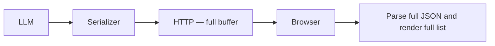
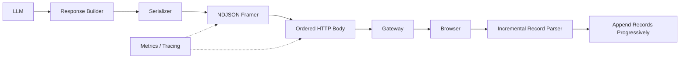
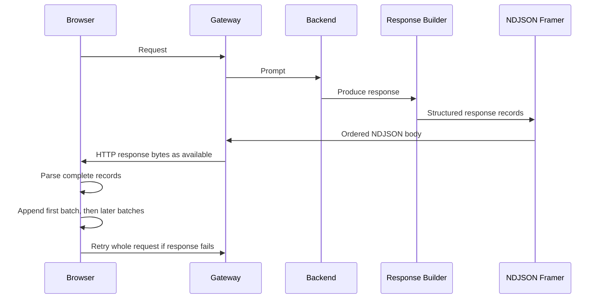

# The Last Mile of LLM Serving: Testing Whether Response Delivery Becomes a Bottleneck in Agentic AI

> Production Engineering • Agentic AI • System Design • LLM Serving

**Reading time:** ~14 minutes
**Difficulty:** Advanced
**Category:** Production Engineering
**Status:** Research note; the reported production investigation is not independently verifiable from this repository.
**Evidence boundary:** The original production traces and payload corpus remain unavailable. The repository now includes a paced loopback browser experiment, but it is a synthetic workload and does not establish production behavior.

> **Note:** This article records a reported engineering investigation. Its production observations and generalized measurements cannot be independently verified here; they should be treated as reported claims, not repository evidence.

**Implementation boundary:** The production investigation described here is broader than the executable code in this repository. The Python reference is a bounded slice for wire validation, chunk splitting, authenticated envelopes, and message-scoped retry and fallback behavior.

## Executive Summary

Most work on LLM serving optimizes inference: GPU scheduling, KV-cache management, batching, speculative decoding, attention kernels. But production systems do not end when the model finishes generating tokens; they end when the user can actually see useful output.

This article examines the hypothesis that response delivery can delay visible progress after inference has completed. The production account describes large structured responses as the trigger, but its supporting traces and experiment artifacts are not included here.

**Key takeaways**

- Large payloads may delay visible progress when the server buffers complete responses and the client waits for complete parsing.
- Splitting can improve time-to-first-visible-content only if the server flushes useful units and the client can parse and render them incrementally; the checked-in loopback experiment tests this under a generated list-rendering workload.
- Keeping HTTP does not by itself preserve the application response contract. Incremental delivery requires framing and client behavior that are not specified or implemented in this repository.
- The proposed delivery-layer approach remains a hypothesis pending an end-to-end experiment.

**What this is not:** a new transport protocol, a replacement for SSE/WebSockets, a universal optimization, or a formal production benchmark — no statistical significance testing is implied by the examples here.

No stage-level production trace is available in the repository, so this article does not report a numerical latency decomposition.

## Where This Fits in the LLM Serving Stack

| Layer | Concern | Example |
|---|---|---|
| GPU scheduling | Batching and request scheduling on the GPU | Sarathi-Serve |
| KV cache management | Memory-efficient attention state | vLLM |
| Attention computation | IO-aware attention kernels | FlashAttention |
| Token-level serving | Structured generation execution | SGLang |
| **Response delivery** | **Getting a finished (or partially finished) response to the user quickly** | **This work** |

Prior systems in the rows above optimize inference throughput, GPU utilization, and memory efficiency. This work starts *after* generation completes — none of those optimizations help if a fully formed payload is still held in a buffer before the browser can render anything.

## The Production Problem

The reported problem was that requests with large responses felt slower and less reliable than smaller ones, even when the backend had produced useful content. The account attributes the difference primarily to response serialization and delivery, but neither observation can be checked against repository traces or request data.

The reported investigation compared a single payload with sequential parts. The source measurements are unavailable, so the claimed change in time-to-first-visible-content is not independently verified.


**Why browser rendering can become a bottleneck:** depending on the parser and client architecture, JSON parsing, object allocation, DOM updates, and paint can add work after bytes arrive. Incremental parsing, workers, and render strategy can change where that cost lands and must be measured rather than assumed.

### Hypothesized root cause chain

For a synchronous full-body parser, one possible failure chain is:

```text
Generation completes
        │
        ▼
Response serialized as one object
        │
        ▼
Entire payload buffered before sending
        │
        ▼
Browser receives one large payload
        │
        ▼
      Synchronous JSON parsing may block the main thread
        │
        ▼
DOM update delayed until parsing finishes
        │
        ▼
User perceives latency, even though generation finished earlier
```

The proposed intervention targets buffering, but it cannot improve visible latency if the client waits for the complete body or commits UI state only after the full response. Those server and client conditions must be measured together.

## Latency Decomposition

Total latency can be decomposed as:

```
L = Tg + Ts + Tn + Tp + Tr
```

`Tg` generation, `Ts` serialization, `Tn` network transfer, `Tp` browser parse, `Tr` render/paint. But what a user actually perceives is not `L`; it is closer to:

```
Perceived latency = TTFB + time until first renderable chunk + browser render
```

The instinct is to optimize `Tg`. The metric that governs perceived responsiveness is *time to first visible content*. The delivery layer's job is to shrink that term without necessarily shrinking total payload size or inference cost.

> **Engineering principle:** Before redesigning a production system, decompose end-to-end latency into measurable stages, then optimize the dominant term — not the most visible subsystem.

## Hypotheses to Test

| Hypothesis | Evidence needed to distinguish it |
|---|---|
| Model generation dominates perceived delay | Correlated model completion and first-visible timestamps |
| Data access dominates perceived delay | Data-access spans aligned to the same request trace |
| Network transfer dominates perceived delay | Byte, flush, and client-receive timestamps under controlled network conditions |
| Buffering or client parsing dominates perceived delay | Same payload and runtime with incremental server flush, client parse, and render instrumentation |

The local experiment is the only evidence in this repository. No schedule, production-trace sequence, or adoption timeline is implied by these workloads.

More server capacity, compression, or network tuning may help some stages, but their effect on first-visible content is workload- and client-dependent. They should be compared rather than dismissed without measurements.

## Experiment Protocol and Local Result

The reported production experiments are not reproducible from this repository. The saved standalone run holds the generated payload and list-rendering work constant and varies nominal server pacing. It sweeps generated objects targeting 90 KB and 300 KB at 0.512, 2, 10, and 50 MB/s, with one warmup and five measured runs per mode and cell. The saved standalone artifact contains full-body, gzip-full-body, and uncompressed-framing arms. The server records request receipt, headers completion, scheduled and actual first write, and body completion; the browser records first byte, first visible list content, and full completion, correlated by request ID.

Full mode paints only after parsing the entire JSON object and appending all list rows. Framed mode parses and appends complete NDJSON batches as they arrive. “First visible” is measured at the next animation-frame callback: it represents the complete list in full mode and the first received batch in framed mode (typically 161 rows, sometimes 319 when batches arrive together). In headless Chrome, this is a presentation proxy, not a compositor-confirmed paint timestamp.

The saved standalone HeadlessChrome 154 run used CPython 3.14.6 on Windows 11. At 300 KB, server-observed header-to-first-write medians were 31.98, 8.80, 2.32, and 0.81 ms across the four pacing rates, close to the 16 KB segment targets of 31.25, 8.00, 1.60, and 0.32 ms. First-write schedule lateness stayed below 1 ms, reconciling the earlier sleep-model discrepancy.

Across the standalone matrix, framed first-visible P50 ranged from 44.9 to 76.7 ms; full-body first-visible ranged from 46.4 to 647.3 ms. At 300 KB and 0.512 MB/s for the structured payload, first-visible was 647.3 ms full versus 76.1 ms framed, while completion was 647.3 versus 745.3 ms because the NDJSON body carries more bytes. At 50 MB/s, that same case measured 66.5 versus 46.1 ms first-visible and 66.5 versus 75.8 ms to complete. These figures match [`browser_results.json`](../benchmarks/response-delivery/browser_results.json). The result depends strongly on imposed transfer rate; it shows the expected availability trade-off and does not establish that the reported production workload was transfer-bound.

`PerformanceObserver` reported Long Task support. A 120 ms blocking positive control was detected as a 120 ms Long Task. The generated list workload produced zero Long Tasks in both modes, including 3,447 rows. This is a negative finding for long blocking tasks in this specific UI/browser, not a universal claim about browser rendering. Raw client samples, server timestamps, runtime versions, and rates are recorded in [`browser_results.json`](../benchmarks/response-delivery/browser_results.json).

### Compression and Framing Follow-up

A separate four-arm matrix was run in the VS Code Electron-embedded browser and saved as [`browser_results_compression.json`](../benchmarks/response-delivery/browser_results_compression.json). It compares full JSON, gzip full JSON, uncompressed NDJSON, and gzip-compressed NDJSON over two generated payload kinds, two target sizes, and four pacing rates, with one warmup and five measured runs per mode/cell. The result contains 384 correlated server timing records. It is an Electron result, not a replacement for the standalone-Chrome baseline. The browser parser consumed the gzip-framed records and rendered the rows, but the 120 ms Long Task positive control was not detected, so this run does not support Long Task claims.

At the 300 KB target and 10 MB/s, the measured P50 first-visible / completion times were:

| Generated payload (serialized bytes) | Full JSON | Gzip full JSON | NDJSON | Gzip NDJSON |
|---|---:|---:|---:|---:|
| Structured (300,007 B) | 93.5 / 93.5 ms | 75.1 / 75.1 ms | 47.5 / 123.5 ms | 48.1 / 76.4 ms |
| Text-like (443,577 B) | 99.8 / 99.8 ms | 74.9 / 74.9 ms | 47.3 / 95.5 ms | 49.8 / 59.1 ms |

The text-like generator overshoots its 300 KB target; its actual serialized size is shown. Across gzip levels 1, 3, 6, and 9, the structured payload's gzip-full ratio ranged from 7.88% to 13.55%, and gzip-NDJSON from 6.91% to 11.99%. The generated text-like payload ranged from 15.87% to 26.61% for gzip-full and 15.57% to 26.65% for gzip-NDJSON. Compression CPU was averaged over 100 process-time repetitions for the precomputed full and framed bodies; it is not per-request compression cost. These payloads remain synthetic and do not constitute a representative CRM compression-ratio corpus.

The gzip-NDJSON arm compresses the complete NDJSON body before request timing, then delivers that gzip stream through chunked HTTP transfer. It tests browser decoding and incremental record parsing, but not streaming compressor flush behavior or per-request compression CPU. The complete rate table and raw samples are in the linked Electron artifact; use it only as exploratory evidence because its Long Task control failed.

## Production Constraints

The reported constraints were a browser client, an HTTP request-response API, and a preference to avoid adopting WebSockets. These constraints are not independently verified. Retaining HTTP is compatible with incremental response bodies, but a versioned application framing format and client-side streaming parser would still be required; compatibility with the existing JSON contract is therefore an open question, not an established property.

## Alternatives Considered

| Candidate | Question to measure |
|---|---|
| Full response buffering | Baseline first-visible and total completion time |
| Compression | Whether transfer savings outweigh compression/decompression cost |
| Pagination | Whether useful partial results can be selected without extra interaction cost |
| Single-response HTTP body with NDJSON framing | Whether flush and client parse/render behavior move first-visible time earlier |
| SSE / WebSockets | Whether persistent event semantics justify their compatibility and operational cost |
| Client-side parsing or rendering changes | Whether browser work, rather than delivery, is the dominant stage |

An incrementally delivered HTTP response body is HTTP streaming. The design selected for this article's experiment is one ordered response body containing newline-delimited JSON records. The server flushes records; the browser consumes them through a readable stream and parses/renders incrementally. This differs from SSE's event-stream contract and WebSockets' persistent, bidirectional message channel, although all are streaming approaches. The experiment supports this framing candidate only under the synthetic conditions above.

Token streaming addresses a different stage when model generation is still in progress. It does not by itself solve delivery of an already-generated structured payload, and an incremental structured-response design still needs explicit framing and client semantics.

## Architecture Decision Record

```text
Decision:
  Use one NDJSON-framed HTTP response as the candidate for progressive
  delivery in this investigation; do not add per-record retry envelopes.

Status:
  Experiment design selected; production architecture not validated

Context:
  Large structured payloads delayed first visible content, independent
  of model inference time.

Alternatives considered:
  Full JSON body, NDJSON-framed response body, SSE, WebSockets

Not established:
  The repository's loopback comparison covers only generated list records
  over paced HTTP; it does not compare production alternatives or prove
  that this protocol wins for a real workload.

Proposed because:
  A paced browser experiment directly compared first-visible and full
  completion time for the same records rendered as one body or batches.

Consequences:
  + Progressive parsing and rendering within one ordered HTTP response
  - Framed representation is larger and full completion can be slower
  - A failed response requires retrying the request; no per-record retry
  - Client streaming parser and partial-state handling are required
```

## Delivery Layer Design

```
serialize each list item as one JSON object followed by a newline
write complete records incrementally to one HTTP response body
parse complete records as they arrive
append records to the list and expose partial completion state
if the response fails: discard incomplete state and retry the whole request
```

No payload-size threshold is selected. The rate sweep shows that the first-visibility trade-off changes with transfer rate and body size; these results are not sufficient to derive a production threshold.

## Record Framing

The selected candidate uses one newline-delimited JSON object per application record. Newlines inside JSON strings are escaped by JSON serialization, so the record delimiter remains unambiguous. This is an ordered single-response stream, not a set of independently retransmittable fragments.

HTTP/TCP preserves byte order and detects transport loss within a connection. If the response terminates before completion, the client discards partial state and retries the whole request; the design does not add per-record CRC/HMAC fields, duplicate handling, sequence reordering, or missing-record retries. Those are different requirements and need a different protocol.

No server/client NDJSON adapter is included in the reference implementation. The standalone browser harness is the only executable example of this selected framing candidate.

## Architecture

The following diagrams show the selected experiment candidate, not an implemented deployment. The files under `diagrams/adaptive-response-delivery/` document the separate authenticated-envelope reference protocol, not this NDJSON stream.

**Before:**



**After:**





### Reference implementation

  The browser-tested NDJSON candidate has no production adapter or separate reference client/server implementation; the harness is its only executable example. The package under `04-reference-implementation/adaptive-response-filter/` is a different, separately tested protocol exercise: it buffers before yielding authenticated envelopes and models message-scoped reassembly/retry. It is not the implementation of the selected single-response design and is not evidence for its browser results.

  For this single ordered HTTP body, TCP provides byte ordering and transport retransmission. If the response ends early, the client discards incomplete list state and retries the whole request. Per-record CRC/HMAC fields, sequence reordering, duplicate suppression, missing-record retry, and a message manager are not part of this selected design. The existing envelope package remains an alternative protocol example, not a dependency of this article's architecture.

### Design principles

- Use one ordered HTTP response body with explicit NDJSON record framing.
- Require an opt-in/versioned response contract and an incremental client parser.
- Render records progressively; discard partial state and retry the whole request on failure.
- Keep any eventual rollout reversible and instrumented.
- Measure first byte, first rendered batch, full completion, and client errors.

## Observability

```text
payload_bytes, framed_body_bytes, nominal_pacing_rate, request_id
server_request_received, response_headers_complete, server_first_write_target
server_first_write_actual, client_first_byte, client_first_rendered_batch
client_full_render_complete, response_complete, client_retry_count
longtask_supported, longtask_count, longtask_duration, positive_control_detected
```

The harness records these timestamps for each correlated request and reports `PerformanceObserver` Long Tasks only when support is confirmed by a deliberate 120 ms positive control. In the recorded standalone run, the control was detected at 120 ms and the generated list workload had zero Long Tasks. The animation-frame boundary is a rendering proxy, not a physical-display paint measurement.

## Current Evidence

The repository has a paced loopback rate sweep with server/client timestamp pairs. It demonstrates earlier first-batch availability at lower transfer rates in this generated list workload, while full completion remains slower for the larger NDJSON representation. Building and appending a 3,447-row list produced no Long Task over 50 ms, even though the positive control detected a deliberate 120 ms block. Thus this simple UI does not reproduce a long blocking render; it does not rule out expensive rendering in a richer production UI. The separate Python envelope benchmark concerns an unselected alternative protocol. See [the evidence map](../EVIDENCE.md) for exact claim boundaries.

## Trade-offs and Limitations

The paced loopback test observed earlier first-batch visibility for framed HTTP at lower rates, but later full completion because framing increased body size. At the highest rate, first-visible differences narrowed and remained within one or two animation frames. In this generated UI, full-body JSON parsing and rendering completed without a Long Task; the production account's much larger render cost is not reproduced here.

**Threats to validity:** the browser experiment uses standalone Chrome, a generated list, loopback HTTP/1.1, server-side bandwidth pacing, and a small sample count. It does not model a real network path, production payloads, other browsers, or a customer UI. No external-validity claim follows from this experiment.

**When not to use this:**

- The client cannot consume framed records or discard incomplete state safely.
- SSE or WebSockets are already available and the client already handles them.
- Payloads are mostly binary rather than structured JSON/text.
- Inference genuinely dominates end-to-end latency, so delivery isn't the bottleneck to begin with.

## Proposed Rollout Strategy

The percentages below are illustrative rollout stages, not a record of an executed deployment.


At each proposed stage, record first-byte, first-rendered-batch, full completion, client error rate, and whole-request retry rate before expanding. This rollout was not reproduced in the repository.

## Related Work

vLLM, Sarathi-Serve, Orca, and FlashAttention optimize inference throughput, GPU utilization, and memory efficiency — the layers above the response-delivery row in the stack table earlier. This repository is concerned with the boundary immediately after generation finishes.

| Work | Optimizes | Layer |
|---|---|---|
| FlashAttention | Attention kernels | GPU |
| vLLM | KV cache | Serving |
| Orca | Request scheduling | Serving |
| Sarathi-Serve | Batching | Serving |
| **This work** | Response delivery | Client / HTTP |

## Future Work

- Compare paced transfer rates with representative production network traces.
- Add browser tracing to separate parsing, DOM work, and paint cost.
- Evaluate whether whole-request retry is acceptable for the target payload and product contract.

## Engineering Lessons

- Production bottlenecks can sit outside the component initially blamed; traces are needed to identify them.
- Perceived latency can matter more than total latency, but should be measured at the client-visible boundary.
- Delivery contracts deserve the same design attention as generation algorithms.

Modern LLM serving research has improved token generation. Whether delivery dominates a particular user experience depends on the payload, server flush behavior, client parser, and render strategy; the available repository evidence does not answer that question.

## Further Reading

**Academic**

- Dean, J., and Barroso, L. A. "The Tail at Scale." *CACM*, 2013.
- Crankshaw, D. et al. "Clipper: A Low-Latency Online Prediction Serving System." *NSDI*, 2017.
- Agrawal, A. et al. "Taming Throughput-Latency Tradeoff in LLM Inference with Sarathi-Serve." *OSDI*, 2024. https://www.usenix.org/conference/osdi24/presentation/agrawal
- Yu, G. et al. "Orca: A Distributed Serving System for Transformer-Based Generative Models." *OSDI*, 2022.
- Kwon, W. et al. "Efficient Memory Management for Large Language Model Serving with PagedAttention." *SOSP*, 2023. https://arxiv.org/abs/2309.06180
- Dao, T. et al. "FlashAttention: Fast and Memory-Efficient Exact Attention with IO-Awareness." *NeurIPS*, 2022.

**Engineering references**

- Beyer, B. et al. (eds.) *Site Reliability Engineering.* O'Reilly, 2016.
- Kleppmann, M. *Designing Data-Intensive Applications.* O'Reilly, 2017.
- [OpenTelemetry specification](https://opentelemetry.io/docs/specs/otel/) — tracing and span semantics.
- [RFC 9110](https://www.rfc-editor.org/rfc/rfc9110) — HTTP Semantics.

**Practical reading**

- [Ray Serve](https://docs.ray.io/en/latest/serve/index.html) — serving infrastructure.
- [BentoML](https://docs.bentoml.com/) — serving infrastructure.
- [NVIDIA Triton Inference Server](https://docs.nvidia.com/deeplearning/triton-inference-server/index.html) — serving infrastructure.
- [SGLang documentation](https://docs.sglang.io/) — high-performance serving framework for language and multimodal models.
- [Chrome DevTools Performance documentation](https://developer.chrome.com/docs/devtools/performance/) — browser parse/render timing.
